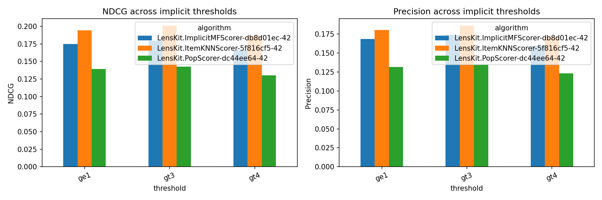
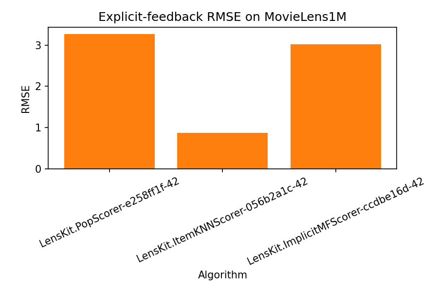
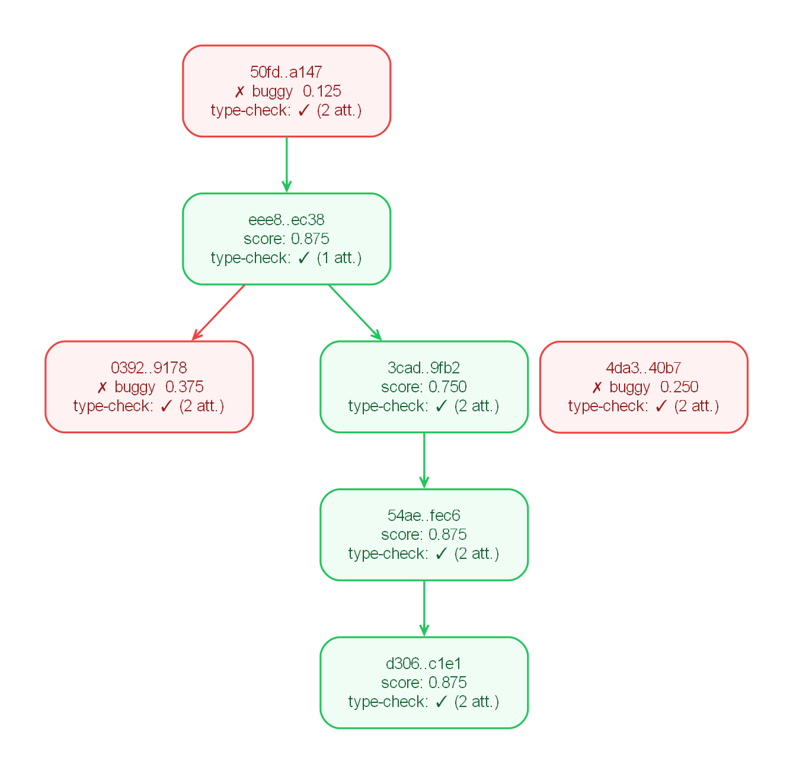

# Example Experiment: Explicit-to-Implicit Conversion on MovieLens1M

This run examined how explicit-to-implicit feedback conversion thresholds affect recommendation quality on MovieLens1M. Three binarization thresholds were evaluated for implicit training and compared with an explicit-feedback evaluation on raw ratings.

The AutoRecLab workflow comprised requirement derivation, tree-search-based prototyping, and a refinement stage that extended the selected prototype to the full experimental specification. In the reported results, `ItemKNNScorer` achieved the strongest ranking performance across implicit settings, `ge1` yielded the highest ranking metrics, and `gt4` yielded the lowest.

## Experimental Setup

- Objective: assess the effect of thresholds `gt3` (>3), `gt4` (>4), and `ge1` (>=1) on ranking quality relative to an explicit-feedback evaluation on raw ratings.
- Dataset: `MovieLens1M`.
- Code-generation model: `gpt-5.4-mini` with `model_temp = 1.0`.
- Prototype search: `num_draft_nodes = 2`, `debug_prob = 0.3`, `epsilon = 0.4`, `max_iterations = 5`.
- Refinement stage: `refinement_iterations = 3`.
- Execution controls: `timeout = 14400`, `enable_type_checking = true`, `max_type_check_attempts = 3`, `keep_only_relevant_files = true`.
- Validation setting: `k_fold_validation = 1`.

## Study Specification

### Research Prompt

```text
Test the influence of different explicit-to-implicit feedback conversion strategies on recommendation accuracy by comparing
multiple binarization thresholds (e.g., treating ratings >3, >4, and >=1 as interactions) against explicit-feedback
algorithms run directly on the raw ratings. Evaluate LensKit's explicit algorithms PopScorer, ItemKNNScorer, and ImplicitMFScorer
alongside implicit algorithms ItemKNNScorer and PopScorer using OmniRec on the MovieLens1M dataset.
Report nDCG@k and Precision@k for the implicit-trained models and RMSE for the explicit-trained models, and compare ranking quality across all conversion strategies and domains.
```

### Runtime Configuration

```toml
out_dir = "./out"

[treesearch]
num_draft_nodes = 2
debug_prob = 0.3
epsilon = 0.4
max_iterations = 5
refinement_iterations = 3

[exec]
timeout = 14400
enable_type_checking = true
max_type_check_attempts = 3
keep_only_relevant_files = true

[agent]
k_fold_validation = 1

[agent.code]
model = "gpt-5.4-mini"
model_temp = 1.0
```

## Results

### Main Findings

- The results comprise full implicit ranking tables for `gt3`, `gt4`, and `ge1`, together with an explicit `RMSE` comparison on raw ratings.
- `ItemKNNScorer` achieved the strongest ranking performance across all implicit thresholds.
- Among the implicit settings, `ge1` yielded the highest ranking metrics, whereas `gt4` yielded the lowest.
- In the explicit setting, `ItemKNNScorer` achieved the lowest `RMSE` (`0.868740`).
- Interpretation of the explicit-versus-implicit comparison is limited because the explicit configuration appears to have been executed once, and the final table mixes ranking metrics with `RMSE`, using `nan` where a metric is not applicable.

### Figures





### Search Trace



### API Usage Summary

The aggregated API usage totals are:

| Prompt Tokens | Prompt USD | Completion Tokens | Completion USD | Total Tokens | Total USD |
| ---: | ---: | ---: | ---: | ---: | ---: |
| 762140 | ~0.5716 | 41731 | ~0.1878 | 803871 | ~0.7594 |

## Appendix: Verbatim Materials

<details>
<summary>Prototype Requirements</summary>

```json
[
    "Use exactly one dataset: MovieLens1M.",
    "Use exactly one algorithm in the prototype; do not compare multiple algorithms or algorithm families.",
    "Run a single end-to-end pipeline from data loading through preprocessing, training, evaluation, and reporting in OmniRec.",
    "Use only one feedback representation/conversion setting in the prototype; do not compare multiple explicit-to-implicit thresholds or explicit-vs-implicit variants.",
    "Use a single split strategy with a fixed random seed for reproducibility.",
    "Evaluate with exactly one metric at one cutoff only, appropriate to the chosen feedback representation.",
    "Produce at least one plot from the experiment results.",
    "Save experiment outputs/checkpoints so the run can be inspected or resumed."
]
```

</details>

<details>
<summary>Final Requirements</summary>

```json
[
    "Load MovieLens1M through OmniRec's dataset loader and keep its canonicalization behavior (duplicate removal and ID normalization).",
    "Use one fixed random seed for the entire experiment so preprocessing and training are reproducible.",
    "Apply one consistent train/validation/test holdout protocol across all runs; only the rating-to-implicit conversion threshold may change between strategy variants.",
    "Run three implicit-conversion variants on MovieLens1M using thresholds ratings > 3, ratings > 4, and ratings >= 1.",
    "For each implicit-conversion variant, evaluate LensKit PopScorer, ItemKNNScorer, and ImplicitMFScorer through OmniRec.",
    "Also evaluate the same algorithms directly on the raw explicit ratings without binarization.",
    "Report nDCG@k and Precision@k for all implicit-feedback runs.",
    "Report RMSE for all explicit-feedback runs.",
    "Evaluate ranking metrics at the existing prototype cutoffs; if none are defined, use at least k = 5, 10, and 20.",
    "Keep all preprocessing and evaluation settings identical across threshold variants except for the binarization rule.",
    "Produce summary tables that compare algorithms across thresholds and separate explicit-vs-implicit training results.",
    "Generate plots that show how threshold choice affects ranking quality and compare algorithms across feedback regimes.",
    "Do not aggregate RMSE with ranking metrics in a single summary statistic; keep results separated by metric type and feedback regime.",
    "Preserve the existing script structure and outputs as much as possible while extending it incrementally rather than rewriting the prototype from scratch."
]
```

</details>

<details>
<summary>Prototype Script</summary>

```python
import os
from pathlib import Path

import matplotlib.pyplot as plt
import pandas as pd

from omnirec import RecSysDataSet, NDCG
from omnirec.data_loaders.datasets import DataSet
from omnirec.preprocess.core_pruning import CorePruning
from omnirec.preprocess.feedback_conversion import MakeImplicit
from omnirec.preprocess.pipe import Pipe
from omnirec.preprocess.split import UserHoldout
from omnirec.runner.algos import LensKit
from omnirec.runner.evaluation import Evaluator
from omnirec.runner.plan import ExperimentPlan
from omnirec.util.run import run_omnirec
from omnirec.util.util import set_random_state

# Prototype simplification: one dataset (MovieLens1M), one algorithm (LensKit.ItemKNNScorer),
# one implicit-conversion threshold, one holdout split, one metric (NDCG@10), and one plot.
# This pilot demonstrates the OmniRec end-to-end pipeline while saving reusable artifacts
# in ./working and leveraging OmniRec's automatic checkpoint directory for resuming runs.


def results_dict_to_dataframe(results_dict):
    frames = []
    for dataset_id, df in results_dict.items():
        tmp = df.copy()
        tmp.insert(0, 'dataset_id', dataset_id)
        frames.append(tmp)
    if frames:
        return pd.concat(frames, ignore_index=True)
    return pd.DataFrame.from_records([], columns=['dataset_id', 'algorithm', 'fold', 'name', 'k', 'value'])


if __name__ == '__main__':
    working_dir = os.path.join(os.getcwd(), 'working')
    os.makedirs(working_dir, exist_ok=True)

    set_random_state(42)

    dataset = RecSysDataSet.use_dataloader(DataSet.MovieLens1M)
    dataset_snapshot_path = Path(working_dir) / 'movielens1m_raw_snapshot.rsds'
    dataset.save(dataset_snapshot_path)

    processed = Pipe(
        MakeImplicit(4),
        CorePruning(5),
        UserHoldout(validation_size=0.2, test_size=0.2),
    ).process(dataset)

    plan = ExperimentPlan('ml1m_prototype_itemknn_ge4')
    plan.add_algorithm(
        LensKit.ItemKNNScorer,
        {
            'feedback': 'implicit',
        },
    )

    evaluator = Evaluator(NDCG([10]))
    run_omnirec(datasets=processed, plan=plan, evaluator=evaluator)

    results_df = results_dict_to_dataframe(evaluator.get_results())
    results_csv_path = Path(working_dir) / 'prototype_results.csv'
    results_json_path = Path(working_dir) / 'prototype_results.json'
    plot_path = Path(working_dir) / 'prototype_ndcg10_plot.png'
    results_df.to_csv(results_csv_path, index=False)
    evaluator.save_results(results_json_path)

    metric_df = results_df[(results_df['name'] == 'NDCG') & (results_df['k'] == 10)].copy()
    fig, ax = plt.subplots(figsize=(6, 4))
    if not metric_df.empty:
        ax.bar(metric_df['algorithm'].astype(str), metric_df['value'].astype(float), color='tab:blue')
        ax.set_ylabel('NDCG@10')
        ax.set_xlabel('Algorithm')
        ax.set_title('OmniRec prototype on MovieLens1M')
        ax.tick_params(axis='x', rotation=25)
    else:
        ax.bar(['no_result'], [0.0], color='tab:blue')
        ax.set_ylabel('NDCG@10')
        ax.set_title('OmniRec prototype on MovieLens1M')
    fig.tight_layout()
    fig.savefig(plot_path, dpi=150)
    plt.close(fig)

    print(f'Working directory: {working_dir}')
    print(f'Saved dataset snapshot: {dataset_snapshot_path}')
    print(f'Saved results CSV: {results_csv_path}')
    print(f'Saved results JSON: {results_json_path}')
    print(f'Saved plot: {plot_path}')
    print(results_df)

```

</details>

<details>
<summary>Final Script</summary>

```python
import os
from pathlib import Path

import matplotlib.pyplot as plt
import pandas as pd

from omnirec import RecSysDataSet
from omnirec.data_loaders.datasets import DataSet
from omnirec.metrics.prediction import RMSE
from omnirec.metrics.ranking import NDCG, Precision
from omnirec.preprocess.core_pruning import CorePruning
from omnirec.preprocess.feedback_conversion import MakeImplicit
from omnirec.preprocess.pipe import Pipe
from omnirec.preprocess.split import UserHoldout
from omnirec.runner.algos import LensKit
from omnirec.runner.evaluation import Evaluator
from omnirec.runner.plan import ExperimentPlan
from omnirec.util.run import run_omnirec
from omnirec.util.util import set_random_state


def results_dict_to_dataframe(results_dict):
    frames = []
    for dataset_id, df in results_dict.items():
        tmp = df.copy()
        tmp.insert(0, 'dataset_id', dataset_id)
        frames.append(tmp)
    if frames:
        return pd.concat(frames, ignore_index=True)
    return pd.DataFrame()


def run_experiment(dataset_name, dataset, plan_name, algorithms, evaluator):
    plan = ExperimentPlan(plan_name)
    for algo, params in algorithms:
        if params is None:
            plan.add_algorithm(algo)
        else:
            plan.add_algorithm(algo, params)
    run_omnirec(datasets=dataset, plan=plan, evaluator=evaluator)
    return results_dict_to_dataframe(evaluator.get_results())


if __name__ == '__main__':
    working_dir = os.path.join(os.getcwd(), 'working')
    os.makedirs(working_dir, exist_ok=True)

    set_random_state(42)

    base_dataset = RecSysDataSet.use_dataloader(DataSet.MovieLens1M)
    dataset_snapshot_path = Path(working_dir) / 'movielens1m_raw_snapshot.rsds'
    base_dataset.save(dataset_snapshot_path)

    holdout = UserHoldout(validation_size=0.2, test_size=0.2)
    core = CorePruning(5)

    implicit_thresholds = [
        ('gt3', 3),
        ('gt4', 4),
        ('ge1', 1),
    ]
    implicit_algorithms = [
        (LensKit.PopScorer, {'feedback': 'implicit'}),
        (LensKit.ItemKNNScorer, {'feedback': 'implicit'}),
        (LensKit.ImplicitMFScorer, {'feedback': 'implicit'}),
    ]

    all_results = []

    for threshold_name, threshold_value in implicit_thresholds:
        processed = Pipe(
            MakeImplicit(threshold_value),
            core,
            holdout,
        ).process(RecSysDataSet.use_dataloader(DataSet.MovieLens1M))
        evaluator = Evaluator(NDCG([5, 10, 20]), Precision([5, 10, 20]))
        res = run_experiment(
            f'MovieLens1M_{threshold_name}',
            processed,
            f'ml1m_implicit_{threshold_name}',
            implicit_algorithms,
            evaluator,
        )
        res['feedback_regime'] = 'implicit'
        res['threshold'] = threshold_name
        all_results.append(res)

    explicit_dataset = Pipe(
        core,
        holdout,
    ).process(RecSysDataSet.use_dataloader(DataSet.MovieLens1M))
    explicit_algorithms = [
    (LensKit.PopScorer, {'feedback': 'explicit'}),
    (LensKit.ItemKNNScorer, {'feedback': 'explicit'}),
    (LensKit.ImplicitMFScorer, {'feedback': 'explicit'}),
    ]

    for threshold_name, threshold_value in implicit_thresholds:
        explicit_dataset = Pipe(
            core,
            holdout,
        ).process(RecSysDataSet.use_dataloader(DataSet.MovieLens1M))

    explicit_evaluator = Evaluator(RMSE())

    explicit_res = run_experiment(
        f'MovieLens1M_explicit_{threshold_name}',
        explicit_dataset,
        f'ml1m_explicit_{threshold_name}',
        explicit_algorithms,
        explicit_evaluator,
    )
    explicit_res['feedback_regime'] = 'explicit'
    explicit_res['threshold'] = threshold_name
    all_results.append(explicit_res)

    results_df = pd.concat(all_results, ignore_index=True) if all_results else pd.DataFrame()
    results_csv_path = Path(working_dir) / 'prototype_results.csv'
    results_json_path = Path(working_dir) / 'prototype_results.json'
    plot_path = Path(working_dir) / 'prototype_ndcg_precision_rmse_plot.png'
    results_df.to_csv(results_csv_path, index=False)
    results_df.to_json(results_json_path, orient='records', indent=2)

    ranking_df = results_df[results_df['feedback_regime'] == 'implicit'].copy()
    fig, axes = plt.subplots(1, 2, figsize=(12, 4))
    if not ranking_df.empty:
        for ax, metric_name in zip(axes, ['NDCG', 'Precision']):
            metric_df = ranking_df[ranking_df['name'] == metric_name].copy()
            if not metric_df.empty:
                pivot = metric_df.pivot_table(index='threshold', columns='algorithm', values='value', aggfunc='mean')
                pivot.plot(kind='bar', ax=ax)
                ax.set_title(f'{metric_name} across implicit thresholds')
                ax.set_ylabel(metric_name)
                ax.tick_params(axis='x', rotation=20)
            else:
                ax.bar(['no_result'], [0.0])
                ax.set_title(f'{metric_name} across implicit thresholds')
    else:
        for ax in axes:
            ax.bar(['no_result'], [0.0])
    fig.tight_layout()
    fig.savefig(plot_path, dpi=150)
    plt.close(fig)

    rmse_df = results_df[(results_df['feedback_regime'] == 'explicit') & (results_df['name'] == 'RMSE')].copy()
    rmse_plot_path = Path(working_dir) / 'prototype_rmse_plot.png'
    fig, ax = plt.subplots(figsize=(6, 4))
    if not rmse_df.empty:
        ax.bar(rmse_df['algorithm'].astype(str), rmse_df['value'].astype(float), color='tab:orange')
        ax.set_ylabel('RMSE')
        ax.set_xlabel('Algorithm')
        ax.set_title('Explicit-feedback RMSE on MovieLens1M')
        ax.tick_params(axis='x', rotation=25)
    else:
        ax.bar(['no_result'], [0.0], color='tab:orange')
        ax.set_ylabel('RMSE')
        ax.set_title('Explicit-feedback RMSE on MovieLens1M')
    fig.tight_layout()
    fig.savefig(rmse_plot_path, dpi=150)
    plt.close(fig)

    print(f'Working directory: {working_dir}')
    print(f'Saved dataset snapshot: {dataset_snapshot_path}')
    print(f'Saved results CSV: {results_csv_path}')
    print(f'Saved results JSON: {results_json_path}')
    print(f'Saved ranking plot: {plot_path}')
    print(f'Saved RMSE plot: {rmse_plot_path}')
    print(results_df)

```

</details>

<details>
<summary>Experiment Summary</summary>

# Experiment Summary

## User Request

Test the influence of different explicit-to-implicit feedback conversion strategies on recommendation accuracy by comparing multiple binarization thresholds against explicit-feedback algorithms run directly on raw ratings, using LensKit algorithms on MovieLens1M. Report nDCG@k and Precision@k for implicit-trained models and RMSE for explicit-trained models, and compare ranking quality across all conversion strategies and domains.

## What Was Run

The code evaluated LensKit algorithms on MovieLens1M under three implicit-feedback conversion settings:

- `gt3`: ratings `> 3` treated as interactions
- `gt4`: ratings `> 4` treated as interactions
- `ge1`: ratings `>= 1` treated as interactions

For each implicit conversion, the following algorithms were trained with `feedback='implicit'`:

- `LensKit.PopScorer`
- `LensKit.ItemKNNScorer`
- `LensKit.ImplicitMFScorer`

Metrics used for these implicit runs:

- `NDCG([5, 10, 20])`
- `Precision([5, 10, 20])`

The code also ran a raw explicit-feedback setup on the 5-core pruned MovieLens1M data, using:

- `LensKit.PopScorer`
- `LensKit.ItemKNNScorer`
- `LensKit.ImplicitMFScorer`

with `feedback='explicit'` and metric `RMSE()`.

Important note from the code/output: the explicit experiment was only executed once, and the printed results show that the explicit run corresponds to the `raw`/`ge1`-style dataset labeling in the final table, but the experiment code itself does not clearly separate explicit runs by threshold. The output includes both ranking metrics and RMSE in the same final table for the raw case, with `nan` where a metric did not apply.

## Key Results

### Implicit-feedback ranking results on MovieLens1M

| Threshold | Algorithm | NDCG@5 | NDCG@10 | NDCG@20 | Precision@5 | Precision@10 | Precision@20 |
|---|---|---:|---:|---:|---:|---:|---:|
| gt3 | PopScorer | 0.152984 | 0.144112 | 0.130101 | 0.146936 | 0.137231 | 0.120702 |
| gt3 | ItemKNNScorer | 0.223913 | 0.203215 | 0.175624 | 0.212653 | 0.188456 | 0.156484 |
| gt3 | ImplicitMFScorer | 0.189686 | 0.181472 | 0.167971 | 0.185956 | 0.175869 | 0.159440 |
| gt4 | PopScorer | 0.128602 | 0.119540 | 0.107111 | 0.122406 | 0.112546 | 0.098260 |
| gt4 | ItemKNNScorer | 0.195958 | 0.172958 | 0.147492 | 0.184521 | 0.157110 | 0.128870 |
| gt4 | ImplicitMFScorer | 0.163582 | 0.153173 | 0.139157 | 0.158701 | 0.146089 | 0.129715 |
| ge1 | PopScorer | 0.172358 | 0.155676 | 0.141188 | 0.167450 | 0.145993 | 0.130182 |
| ge1 | ItemKNNScorer | 0.233006 | 0.211912 | 0.185934 | 0.225132 | 0.198775 | 0.168411 |
| ge1 | ImplicitMFScorer | 0.204107 | 0.193867 | 0.181508 | 0.200331 | 0.187467 | 0.173079 |

### Explicit-feedback results on raw ratings

| Setting | Algorithm | RMSE |
|---|---|---:|
| raw | PopScorer | 3.268749 |
| raw | ItemKNNScorer | 0.868740 |
| raw | ImplicitMFScorer | 3.014612 |

### Ranking quality comparison

- Across all implicit thresholds, `ItemKNNScorer` achieved the best ranking quality.
- The best overall implicit result was at `ge1`:
  - `ItemKNNScorer`: NDCG@5 = 0.233006, Precision@5 = 0.225132
  - `ImplicitMFScorer`: NDCG@5 = 0.204107, Precision@5 = 0.200331
  - `PopScorer`: NDCG@5 = 0.172358, Precision@5 = 0.167450
- For the implicit-trained models, `gt4` produced the weakest ranking results, while `ge1` produced the strongest results in the output.
- For explicit-feedback evaluation, only RMSE is available in the output, and `ItemKNNScorer` had the lowest RMSE among the three explicit models.

## Limitations

- The experiment output is partially ambiguous because the final printed table mixes ranking metrics and RMSE, and includes `nan` entries where a metric was not computed for that run.
- The code intended to compare multiple explicit-to-implicit conversion strategies, but the explicit-feedback section appears to have been run only once, not separately for each threshold.
- The output does not provide a clean one-to-one explicit-vs-implicit comparison for every threshold/algorithm pair beyond the values shown above.
- No separate results were printed for any `LensKit` algorithm names beyond the three listed models.

## Conclusion

On MovieLens1M, the implicit-feedback conversion strategy affected ranking quality clearly:

- `ge1` gave the best implicit ranking results overall.
- `gt4` gave the worst implicit ranking results overall.
- `ItemKNNScorer` was the strongest ranking model across all implicit thresholds.

For explicit feedback on raw ratings, `ItemKNNScorer` also achieved the best RMSE of the three explicit models. The available output supports a clear ranking-quality advantage for `ge1` over `gt3` and `gt4`, but the explicit-versus-implicit comparison is limited because the explicit runs were not reported separately for each conversion threshold.

</details>

<details>
<summary>API Cost Log</summary>

```csv
Position,Timestamp,Model,Prompt Tokens,Prompt USD,Completion Tokens,Completion USD,Total Tokens,Total USD
1,2026-06-22 17:28:06,gpt-5.4-mini,4914,0.0036855,25,0.00011250000000000001,4939,0.003798
2,2026-06-22 17:28:14,gpt-5.4-mini,5319,0.00398925,391,0.0017595,5710,0.0057487499999999995
3,2026-06-22 17:28:20,gpt-5.4-mini,9089,0.00681675,253,0.0011385000000000002,9342,0.00795525
4,2026-06-22 17:28:38,gpt-5.4-mini,28132,0.021099,1692,0.007613999999999999,29824,0.028713
5,2026-06-22 17:28:50,gpt-5.4-mini,6546,0.0049095,1184,0.005327999999999999,7730,0.0102375
6,2026-06-22 17:29:10,gpt-5.4-mini,7018,0.0052635,284,0.001278,7302,0.0065415000000000004
7,2026-06-22 17:29:11,gpt-5.4-mini,1909,0.00143175,41,0.0001845,1950,0.00161625
8,2026-06-22 17:29:12,gpt-5.4-mini,1916,0.001437,72,0.000324,1988,0.001761
9,2026-06-22 17:29:17,gpt-5.4-mini,6995,0.00524625,136,0.000612,7131,0.00585825
10,2026-06-22 17:29:18,gpt-5.4-mini,1928,0.001446,58,0.000261,1986,0.001707
11,2026-06-22 17:29:19,gpt-5.4-mini,1913,0.00143475,72,0.000324,1985,0.0017587500000000001
12,2026-06-22 17:29:21,gpt-5.4-mini,1916,0.001437,73,0.0003285,1989,0.0017655
13,2026-06-22 17:29:22,gpt-5.4-mini,1909,0.00143175,63,0.0002835,1972,0.0017152500000000002
14,2026-06-22 17:29:28,gpt-5.4-mini,1913,0.00143475,65,0.00029249999999999995,1978,0.00172725
15,2026-06-22 17:29:54,gpt-5.4-mini,65257,0.04894274999999999,2113,0.0095085,67370,0.058451249999999996
16,2026-06-22 17:30:11,gpt-5.4-mini,6124,0.004593,1307,0.0058815,7431,0.0104745
17,2026-06-22 17:30:33,gpt-5.4-mini,7179,0.00538425,189,0.0008505,7368,0.00623475
18,2026-06-22 17:30:34,gpt-5.4-mini,2375,0.0017812499999999998,38,0.000171,2413,0.0019522499999999998
19,2026-06-22 17:30:36,gpt-5.4-mini,2382,0.0017865,61,0.0002745,2443,0.002061
20,2026-06-22 17:30:37,gpt-5.4-mini,2388,0.001791,68,0.000306,2456,0.002097
21,2026-06-22 17:30:38,gpt-5.4-mini,2394,0.0017954999999999998,49,0.0002205,2443,0.0020159999999999996
22,2026-06-22 17:30:40,gpt-5.4-mini,2379,0.00178425,76,0.000342,2455,0.00212625
23,2026-06-22 17:30:41,gpt-5.4-mini,2382,0.0017865,69,0.0003105,2451,0.002097
24,2026-06-22 17:30:43,gpt-5.4-mini,2375,0.0017812499999999998,67,0.0003015,2442,0.00208275
25,2026-06-22 17:30:44,gpt-5.4-mini,2379,0.00178425,64,0.000288,2443,0.00207225
26,2026-06-22 17:31:03,gpt-5.4-mini,27984,0.020988,1511,0.0067995,29495,0.0277875
27,2026-06-22 17:33:05,gpt-5.4-mini,2060,0.0015450000000000001,24,0.000108,2084,0.0016530000000000002
28,2026-06-22 17:33:06,gpt-5.4-mini,1872,0.0014039999999999999,39,0.00017549999999999998,1911,0.0015794999999999997
29,2026-06-22 17:33:07,gpt-5.4-mini,1879,0.00140925,45,0.00020250000000000002,1924,0.00161175
30,2026-06-22 17:33:08,gpt-5.4-mini,1885,0.00141375,57,0.0002565,1942,0.00167025
31,2026-06-22 17:33:09,gpt-5.4-mini,1891,0.00141825,49,0.0002205,1940,0.00163875
32,2026-06-22 17:33:10,gpt-5.4-mini,1876,0.001407,47,0.0002115,1923,0.0016185000000000001
33,2026-06-22 17:33:11,gpt-5.4-mini,1879,0.00140925,45,0.00020250000000000002,1924,0.00161175
34,2026-06-22 17:33:12,gpt-5.4-mini,1872,0.0014039999999999999,43,0.00019350000000000001,1915,0.0015975
35,2026-06-22 17:33:14,gpt-5.4-mini,1876,0.001407,58,0.000261,1934,0.001668
36,2026-06-22 17:33:15,gpt-5.4-mini,1960,0.00147,159,0.0007155,2119,0.0021855
37,2026-06-22 17:33:35,gpt-5.4-mini,24692,0.018519,1602,0.007208999999999999,26294,0.025728
38,2026-06-22 17:33:46,gpt-5.4-mini,5004,0.003753,1065,0.0047925,6069,0.0085455
39,2026-06-22 17:33:56,gpt-5.4-mini,5824,0.004368,222,0.000999,6046,0.005367
40,2026-06-22 17:33:57,gpt-5.4-mini,1921,0.00144075,40,0.00018,1961,0.00162075
41,2026-06-22 17:33:58,gpt-5.4-mini,1928,0.001446,45,0.00020250000000000002,1973,0.0016485
42,2026-06-22 17:33:59,gpt-5.4-mini,1934,0.0014505,55,0.0002475,1989,0.0016979999999999999
43,2026-06-22 17:34:00,gpt-5.4-mini,1940,0.0014550000000000001,53,0.0002385,1993,0.0016935000000000001
44,2026-06-22 17:34:02,gpt-5.4-mini,1925,0.0014437500000000002,72,0.000324,1997,0.0017677500000000002
45,2026-06-22 17:34:03,gpt-5.4-mini,1928,0.001446,57,0.0002565,1985,0.0017025
46,2026-06-22 17:34:04,gpt-5.4-mini,1921,0.00144075,51,0.0002295,1972,0.0016702499999999999
47,2026-06-22 17:34:05,gpt-5.4-mini,1925,0.0014437500000000002,63,0.0002835,1988,0.00172725
48,2026-06-22 17:34:27,gpt-5.4-mini,11535,0.00865125,1583,0.0071235,13118,0.015774749999999997
49,2026-06-22 17:34:36,gpt-5.4-mini,5853,0.0043897499999999996,1152,0.005184,7005,0.009573749999999999
50,2026-06-22 17:36:33,gpt-5.4-mini,2176,0.001632,24,0.000108,2200,0.00174
51,2026-06-22 17:36:34,gpt-5.4-mini,1988,0.0014910000000000001,39,0.00017549999999999998,2027,0.0016665
52,2026-06-22 17:36:35,gpt-5.4-mini,1995,0.0014962499999999998,45,0.00020250000000000002,2040,0.0016987499999999997
53,2026-06-22 17:36:36,gpt-5.4-mini,2001,0.0015007500000000001,58,0.000261,2059,0.00176175
54,2026-06-22 17:36:40,gpt-5.4-mini,2007,0.00150525,49,0.0002205,2056,0.00172575
55,2026-06-22 17:36:41,gpt-5.4-mini,1992,0.0014939999999999999,59,0.0002655,2051,0.0017594999999999998
56,2026-06-22 17:36:42,gpt-5.4-mini,1995,0.0014962499999999998,44,0.000198,2039,0.0016942499999999998
57,2026-06-22 17:36:43,gpt-5.4-mini,1988,0.0014910000000000001,43,0.00019350000000000001,2031,0.0016845000000000002
58,2026-06-22 17:36:44,gpt-5.4-mini,1992,0.0014939999999999999,45,0.00020250000000000002,2037,0.0016964999999999999
59,2026-06-22 17:36:46,gpt-5.4-mini,2076,0.0015570000000000002,189,0.0008505,2265,0.0024075000000000004
60,2026-06-22 17:37:23,gpt-5.4-mini,46012,0.034509,2010,0.009045000000000001,48022,0.043553999999999995
61,2026-06-22 17:37:35,gpt-5.4-mini,11661,0.00874575,1409,0.006340500000000001,13070,0.01508625
62,2026-06-22 17:39:33,gpt-5.4-mini,2367,0.0017752500000000001,24,0.000108,2391,0.0018832500000000002
63,2026-06-22 17:39:34,gpt-5.4-mini,2179,0.0016342499999999999,44,0.000198,2223,0.00183225
64,2026-06-22 17:39:35,gpt-5.4-mini,2186,0.0016395,45,0.00020250000000000002,2231,0.0018419999999999999
65,2026-06-22 17:39:36,gpt-5.4-mini,2192,0.001644,61,0.0002745,2253,0.0019185
66,2026-06-22 17:39:37,gpt-5.4-mini,2198,0.0016484999999999998,49,0.0002205,2247,0.0018689999999999998
67,2026-06-22 17:39:38,gpt-5.4-mini,2183,0.00163725,48,0.000216,2231,0.00185325
68,2026-06-22 17:39:39,gpt-5.4-mini,2186,0.0016395,41,0.0001845,2227,0.0018239999999999999
69,2026-06-22 17:39:41,gpt-5.4-mini,2179,0.0016342499999999999,35,0.00015749999999999998,2214,0.00179175
70,2026-06-22 17:39:42,gpt-5.4-mini,2183,0.00163725,51,0.0002295,2234,0.00186675
71,2026-06-22 17:39:44,gpt-5.4-mini,2267,0.00170025,132,0.000594,2399,0.00229425
72,2026-06-22 17:40:00,gpt-5.4-mini,25161,0.01887075,1623,0.0073035,26784,0.02617425
73,2026-06-22 17:40:10,gpt-5.4-mini,7942,0.0059565,1241,0.005584499999999999,9183,0.011541
74,2026-06-22 17:42:07,gpt-5.4-mini,2355,0.00176625,24,0.000108,2379,0.00187425
75,2026-06-22 17:42:09,gpt-5.4-mini,2167,0.00162525,36,0.000162,2203,0.00178725
76,2026-06-22 17:42:10,gpt-5.4-mini,2174,0.0016305,48,0.000216,2222,0.0018465
77,2026-06-22 17:42:11,gpt-5.4-mini,2180,0.0016350000000000002,54,0.000243,2234,0.0018780000000000001
78,2026-06-22 17:42:12,gpt-5.4-mini,2186,0.0016395,50,0.00022500000000000002,2236,0.0018644999999999998
79,2026-06-22 17:42:13,gpt-5.4-mini,2171,0.0016282500000000001,57,0.0002565,2228,0.0018847500000000001
80,2026-06-22 17:42:14,gpt-5.4-mini,2174,0.0016305,38,0.000171,2212,0.0018015
81,2026-06-22 17:42:15,gpt-5.4-mini,2167,0.00162525,45,0.00020250000000000002,2212,0.00182775
82,2026-06-22 17:42:17,gpt-5.4-mini,2171,0.0016282500000000001,71,0.0003195,2242,0.0019477500000000003
83,2026-06-22 17:42:19,gpt-5.4-mini,2255,0.00169125,106,0.000477,2361,0.00216825
84,2026-06-22 17:42:33,gpt-5.4-mini,13520,0.01014,681,0.0030645,14201,0.0132045
85,2026-06-22 17:42:41,gpt-5.4-mini,7641,0.00573075,474,0.002133,8115,0.00786375
86,2026-06-22 17:44:47,gpt-5.4-mini,14649,0.01098675,279,0.0012555,14928,0.01224225
87,2026-06-22 17:44:49,gpt-5.4-mini,2189,0.00164175,71,0.0003195,2260,0.00196125
88,2026-06-22 17:44:50,gpt-5.4-mini,2182,0.0016365,57,0.0002565,2239,0.001893
89,2026-06-22 17:44:51,gpt-5.4-mini,2193,0.00164475,90,0.00040500000000000003,2283,0.00204975
90,2026-06-22 17:44:54,gpt-5.4-mini,2194,0.0016455000000000003,66,0.000297,2260,0.0019425000000000002
91,2026-06-22 17:44:55,gpt-5.4-mini,2195,0.00164625,70,0.00031499999999999996,2265,0.00196125
92,2026-06-22 17:44:57,gpt-5.4-mini,2181,0.00163575,73,0.0003285,2254,0.00196425
93,2026-06-22 17:44:58,gpt-5.4-mini,2181,0.00163575,57,0.0002565,2238,0.00189225
94,2026-06-22 17:44:59,gpt-5.4-mini,2174,0.0016305,63,0.0002835,2237,0.001914
95,2026-06-22 17:45:00,gpt-5.4-mini,2195,0.00164625,71,0.0003195,2266,0.00196575
96,2026-06-22 17:45:02,gpt-5.4-mini,2183,0.00163725,56,0.000252,2239,0.00188925
97,2026-06-22 17:45:03,gpt-5.4-mini,2183,0.00163725,72,0.000324,2255,0.00196125
98,2026-06-22 17:45:04,gpt-5.4-mini,2182,0.0016365,79,0.00035549999999999997,2261,0.001992
99,2026-06-22 17:45:06,gpt-5.4-mini,2189,0.00164175,68,0.000306,2257,0.00194775
100,2026-06-22 17:45:07,gpt-5.4-mini,2190,0.0016425,85,0.00038250000000000003,2275,0.002025
101,2026-06-22 17:45:25,gpt-5.4-mini,17632,0.013224,2631,0.011839500000000001,20263,0.025063500000000002
102,2026-06-22 17:45:48,gpt-5.4-mini,16109,0.012081749999999999,310,0.001395,16419,0.01347675
103,2026-06-22 17:45:49,gpt-5.4-mini,2816,0.002112,101,0.0004545,2917,0.0025665
104,2026-06-22 17:45:50,gpt-5.4-mini,2809,0.00210675,59,0.0002655,2868,0.0023722500000000002
105,2026-06-22 17:45:52,gpt-5.4-mini,2820,0.002115,71,0.0003195,2891,0.0024345
106,2026-06-22 17:45:53,gpt-5.4-mini,2821,0.00211575,73,0.0003285,2894,0.0024442500000000002
107,2026-06-22 17:45:54,gpt-5.4-mini,2822,0.0021165,62,0.000279,2884,0.0023955
108,2026-06-22 17:45:56,gpt-5.4-mini,2808,0.0021060000000000002,63,0.0002835,2871,0.0023895
109,2026-06-22 17:45:57,gpt-5.4-mini,2808,0.0021060000000000002,74,0.00033299999999999996,2882,0.002439
110,2026-06-22 17:45:59,gpt-5.4-mini,2801,0.00210075,59,0.0002655,2860,0.0023662500000000003
111,2026-06-22 17:46:00,gpt-5.4-mini,2822,0.0021165,48,0.000216,2870,0.0023325
112,2026-06-22 17:46:01,gpt-5.4-mini,2810,0.0021075,56,0.000252,2866,0.0023595
113,2026-06-22 17:46:03,gpt-5.4-mini,2810,0.0021075,67,0.0003015,2877,0.002409
114,2026-06-22 17:46:04,gpt-5.4-mini,2809,0.00210675,59,0.0002655,2868,0.0023722500000000002
115,2026-06-22 17:46:06,gpt-5.4-mini,2816,0.002112,59,0.0002655,2875,0.0023775000000000003
116,2026-06-22 17:46:07,gpt-5.4-mini,2817,0.00211275,64,0.000288,2881,0.00240075
117,2026-06-22 17:46:23,gpt-5.4-mini,17589,0.01319175,2385,0.010732499999999999,19974,0.02392425
118,2026-06-22 18:07:25,gpt-5.4-mini,3465,0.0025987500000000004,24,0.000108,3489,0.0027067500000000004
119,2026-06-22 18:07:30,gpt-5.4-mini,8793,0.00659475,125,0.0005625000000000001,8918,0.00715725
120,2026-06-22 18:07:31,gpt-5.4-mini,3117,0.00233775,58,0.000261,3175,0.00259875
121,2026-06-22 18:07:33,gpt-5.4-mini,3128,0.002346,73,0.0003285,3201,0.0026745
122,2026-06-22 18:07:34,gpt-5.4-mini,3129,0.00234675,61,0.0002745,3190,0.00262125
123,2026-06-22 18:07:36,gpt-5.4-mini,3130,0.0023474999999999998,92,0.000414,3222,0.0027614999999999996
124,2026-06-22 18:07:37,gpt-5.4-mini,3116,0.0023369999999999997,77,0.0003465,3193,0.0026834999999999997
125,2026-06-22 18:07:39,gpt-5.4-mini,3116,0.0023369999999999997,55,0.0002475,3171,0.0025844999999999996
126,2026-06-22 18:07:40,gpt-5.4-mini,3109,0.0023317499999999996,68,0.000306,3177,0.0026377499999999995
127,2026-06-22 18:07:41,gpt-5.4-mini,3130,0.0023474999999999998,68,0.000306,3198,0.0026534999999999996
128,2026-06-22 18:07:43,gpt-5.4-mini,3118,0.0023385000000000003,87,0.00039150000000000003,3205,0.0027300000000000002
129,2026-06-22 18:07:44,gpt-5.4-mini,3118,0.0023385000000000003,75,0.00033749999999999996,3193,0.0026760000000000004
130,2026-06-22 18:07:45,gpt-5.4-mini,3117,0.00233775,50,0.00022500000000000002,3167,0.00256275
131,2026-06-22 18:07:52,gpt-5.4-mini,3124,0.002343,66,0.000297,3190,0.00264
132,2026-06-22 18:07:54,gpt-5.4-mini,3125,0.0023437500000000003,62,0.000279,3187,0.0026227500000000005
133,2026-06-22 18:08:18,gpt-5.4-mini,35662,0.0267465,2867,0.012901500000000002,38529,0.039648
134,2026-06-22 18:08:35,gpt-5.4-mini,8605,0.006453749999999999,2293,0.0103185,10898,0.01677225
135,2026-06-22 18:08:51,gpt-5.4-mini,9173,0.0068797500000000004,219,0.0009855,9392,0.00786525
136,2026-06-22 18:08:56,gpt-5.4-mini,9189,0.0068917499999999994,135,0.0006075,9324,0.007499249999999999
137,2026-06-22 18:08:57,gpt-5.4-mini,2839,0.00212925,59,0.0002655,2898,0.00239475
138,2026-06-22 18:08:59,gpt-5.4-mini,2850,0.0021375,83,0.00037349999999999997,2933,0.002511
139,2026-06-22 18:09:00,gpt-5.4-mini,2851,0.00213825,49,0.0002205,2900,0.0023587499999999997
140,2026-06-22 18:09:02,gpt-5.4-mini,2852,0.002139,69,0.0003105,2921,0.0024495
141,2026-06-22 18:09:03,gpt-5.4-mini,2838,0.0021284999999999997,68,0.000306,2906,0.0024344999999999996
142,2026-06-22 18:09:06,gpt-5.4-mini,2838,0.0021284999999999997,59,0.0002655,2897,0.002394
143,2026-06-22 18:09:08,gpt-5.4-mini,2831,0.00212325,66,0.000297,2897,0.00242025
144,2026-06-22 18:09:09,gpt-5.4-mini,2852,0.002139,71,0.0003195,2923,0.0024584999999999997
145,2026-06-22 18:09:11,gpt-5.4-mini,2840,0.00213,83,0.00037349999999999997,2923,0.0025035
146,2026-06-22 18:09:12,gpt-5.4-mini,2840,0.00213,59,0.0002655,2899,0.0023955
147,2026-06-22 18:09:14,gpt-5.4-mini,2839,0.00212925,57,0.0002565,2896,0.00238575
148,2026-06-22 18:09:16,gpt-5.4-mini,2846,0.0021345,51,0.0002295,2897,0.002364
149,2026-06-22 18:09:17,gpt-5.4-mini,2847,0.00213525,58,0.000261,2905,0.00239625
150,2026-06-22 18:09:24,gpt-5.4-mini,3072,0.002304,1107,0.0049815,4179,0.0072855
SUMMARIZED,-,-,762140,0.5716049999999997,41731,0.18778950000000005,803871,0.7593945

```

</details>
