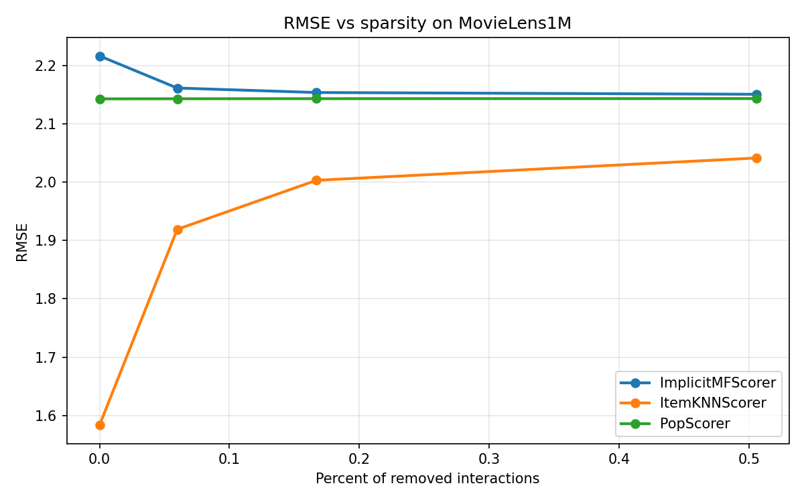
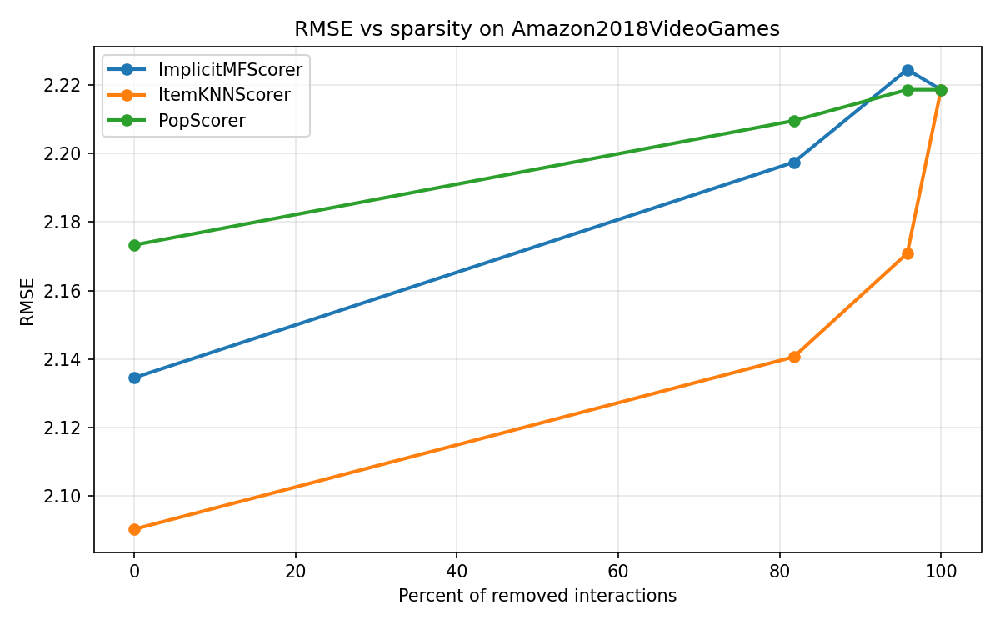
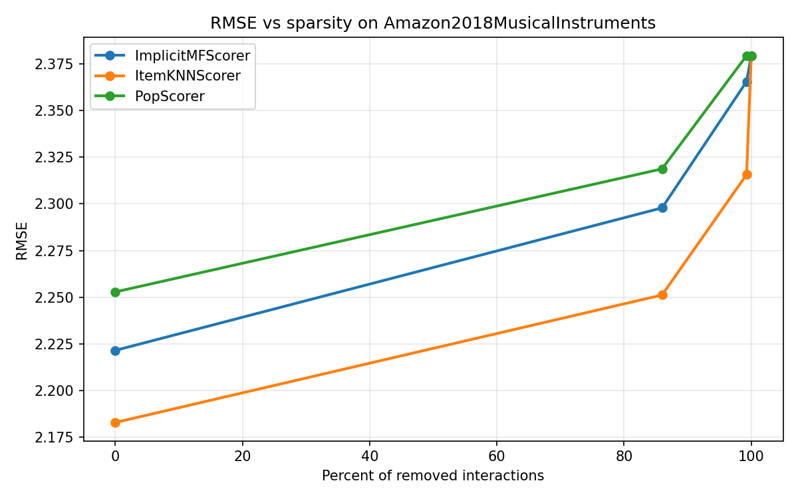
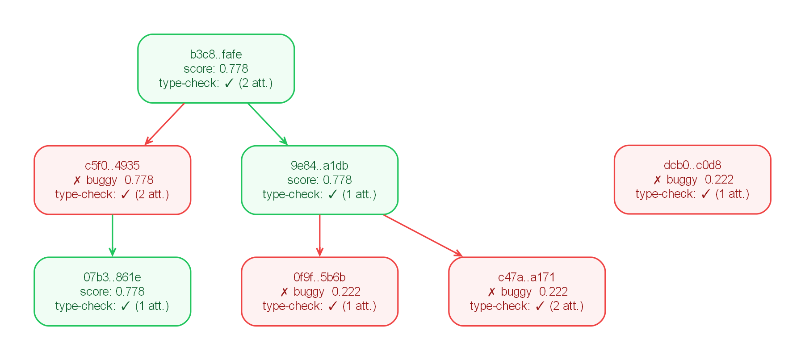

# Example Experiment: Dataset Pruning Effects on RMSE Across Three Datasets

This run examined how dataset pruning affects rating-prediction error for `ImplicitMFScorer`, `ItemKNNScorer`, and `PopScorer` across three recommendation datasets. Four pruning conditions were evaluated for each dataset: an unpruned baseline and user-core thresholds of 5, 10, and 20 interactions.

The AutoRecLab workflow comprised requirement derivation, tree-search-based prototyping, and a refinement stage that extended the selected prototype to the full experimental specification. The reported results indicate only minor RMSE changes on `MovieLens1M`, improved `ItemKNNScorer` performance under pruning on both Amazon datasets, and degraded `ImplicitMFScorer` and `PopScorer` performance under pruning on `Amazon2018MusicalInstruments`. The `core20` condition was not evaluable for the two Amazon datasets because pruning emptied the data.

## Experimental Setup

- Objective: assess how pruning thresholds affect RMSE for `ImplicitMFScorer`, `ItemKNNScorer`, and `PopScorer`.
- Datasets: `MovieLens1M`, `Amazon2018VideoGames`, `Amazon2018MusicalInstruments`.
- Algorithms and fixed hyperparameters:
  - `ImplicitMFScorer` with `n_factors=50`
  - `ItemKNNScorer` with `max_nbrs=20`, `min_nbrs=5`
  - `PopScorer`
- Pruning conditions: `baseline`, `core5`, `core10`, `core20`.
- Split and evaluation: `TimeBasedHoldout(validation=0.10, test=0.20)` with `RMSE` only.
- Code-generation model: `gpt-5.4-mini` with `model_temp = 1.0`.
- Prototype search: `num_draft_nodes = 2`, `debug_prob = 0.3`, `epsilon = 0.4`, `max_iterations = 5`.
- Refinement stage: `refinement_iterations = 3`.
- Execution controls: `timeout = 14400`, `enable_type_checking = true`, `max_type_check_attempts = 3`, `keep_only_relevant_files = true`.

## Study Specification

### Research Prompt

```text
Test the influence of dataset pruning on LensKit's ImplicitMFScorer, ItemKNNScorer, and PopScorer using OmniRec on the
MovieLens1M, Amazon2018VideoGames, and Amazon2018MusicalInstruments datasets.
Always use a 70/10/20 (train/validation/test) split for rating evaluation only.
Create multiple pruned versions of each dataset by removing users with fewer than {5, 10, 20} interactions while retaining an unpruned baseline.
Train and evaluate each algorithm independently on every pruning level using the same hyperparameters.
Measure RMSE and compare how performance changes as sparsity increases.
Visualize performance trends as line plots vs percentage of removed users/interactions and save the plots as image files.
```

### Runtime Configuration

```toml
out_dir = "./out"

[treesearch]
num_draft_nodes = 2
debug_prob = 0.3
epsilon = 0.4
max_iterations = 5
refinement_iterations = 3

[exec]
timeout = 14400
enable_type_checking = true
max_type_check_attempts = 3
keep_only_relevant_files = true

[agent]
k_fold_validation = 1

[agent.code]
model = "gpt-5.4-mini"
model_temp = 1.0
```

## Results

### Main Findings

- All three datasets were evaluated across four pruning levels, although some dataset/pruning combinations did not produce a result.
- On `MovieLens1M`, RMSE changed only slightly across pruning levels for all three algorithms.
- On `Amazon2018VideoGames`, `ImplicitMFScorer` worsened at `core5` and `core10`, `ItemKNNScorer` improved at both levels, and `PopScorer` showed mixed behavior relative to baseline.
- On `Amazon2018MusicalInstruments`, `ImplicitMFScorer` worsened substantially with pruning, `ItemKNNScorer` improved with pruning, and `PopScorer` worsened with pruning.
- The `core20` condition on both Amazon datasets was not evaluable because pruning emptied the data and LensKit failed with `invalid ID type null`.
- Interpretation is limited by those failed runs and by the absence of directly readable removed-user and removed-interaction percentages in the visible summary table.

### Figures







### Search Trace



### API Usage Summary

The aggregated API usage totals are:

| Prompt Tokens | Prompt USD | Completion Tokens | Completion USD | Total Tokens | Total USD |
| ---: | ---: | ---: | ---: | ---: | ---: |
| 830521 | ~0.6229 | 42623 | ~0.1918 | 873144 | ~0.8147 |

## Appendix: Verbatim Materials

<details>
<summary>Prototype Requirements</summary>

```json
[
    "Use OmniRec as the experiment orchestration and preprocessing framework.",
    "Use exactly one dataset: MovieLens1M.",
    "Use exactly one algorithm: LensKit ItemKNNScorer.",
    "Apply a 70/10/20 train/validation/test split for rating prediction evaluation.",
    "Create exactly two dataset variants for the prototype: an unpruned baseline and one pruned variant using a single user-interaction threshold.",
    "Evaluate with RMSE only.",
    "Train and evaluate the chosen algorithm independently on both dataset variants with the same fixed hyperparameters.",
    "Produce at least one plot comparing the baseline and pruned results and save it as an image file.",
    "Set a fixed random seed for reproducibility."
]
```

</details>

<details>
<summary>Final Requirements</summary>

```json
[
    "Use OmniRec as the orchestration layer for loading data, preprocessing, splitting, running experiments, and reporting results.",
    "Load the three datasets MovieLens1M, Amazon2018VideoGames, and Amazon2018MusicalInstruments through OmniRec dataset loaders.",
    "Create four dataset conditions for each dataset: an unpruned baseline and pruned variants with users below 5, 10, and 20 interactions removed.",
    "Apply pruning before the train/validation/test split so each pruning level defines a separate evaluation cohort.",
    "Use the same deterministic 70/10/20 train/validation/test split for every dataset condition.",
    "Train and evaluate OmniRec-exposed LensKit algorithms ImplicitMFScorer, ItemKNNScorer, and PopScorer on every dataset condition.",
    "Keep model hyperparameters fixed across all pruning levels for a given algorithm.",
    "Evaluate RMSE on the test split for every dataset/algorithm/pruning combination.",
    "Record the proportion of removed users and interactions for each pruning level so RMSE can be compared against sparsity.",
    "Generate line plots of RMSE versus pruning severity for each algorithm and dataset, and save them as image files.",
    "Preserve the existing script structure and existing outputs where possible while extending the script to add the requested datasets, pruning levels, evaluation, and plots.",
    "Use a stable random seed or equivalent deterministic configuration so repeated runs produce the same splits and results."
]
```

</details>

<details>
<summary>Prototype Script</summary>

```python
import os
from pathlib import Path

import matplotlib.pyplot as plt
import pandas as pd

from omnirec import RecSysDataSet
from omnirec.data_loaders.datasets import DataSet
from omnirec.metrics.prediction import RMSE
from omnirec.preprocess.core_pruning import CorePruning
from omnirec.preprocess.split import TimeBasedHoldout
from omnirec.runner.algos import LensKit
from omnirec.runner.evaluation import Evaluator
from omnirec.runner.plan import ExperimentPlan
from omnirec.util.run import run_omnirec
from omnirec.util.util import set_random_state

# Prototype simplification: one dataset (MovieLens1M), one algorithm (ItemKNNScorer),
# one metric (RMSE), one verified split, and exactly two conditions: unpruned baseline
# vs. a single pruned variant. This keeps the pilot minimal while validating the full
# OmniRec preprocessing -> training -> evaluation -> reporting pipeline.


def extract_rmse_rows(result_map: dict, condition: str) -> list[dict]:
    rows = []
    for dataset_id, df in result_map.items():
        if "name" not in df.columns or "value" not in df.columns:
            continue
        rmse_df = df[df["name"] == "RMSE"].copy()
        if rmse_df.empty:
            continue
        rmse_df["condition"] = condition
        rmse_df["dataset_id"] = dataset_id
        rows.append(rmse_df)
    return rows


def main():
    working_dir = os.path.join(os.getcwd(), "working")
    os.makedirs(working_dir, exist_ok=True)
    set_random_state(42)

    base_dataset = RecSysDataSet.use_dataloader(DataSet.MovieLens1M)

    conditions = [
        ("baseline", None),
        ("pruned_core5", CorePruning(5)),
    ]

    all_rows = []

    for condition_name, preprocessor in conditions:
        dataset = base_dataset
        if preprocessor is not None:
            dataset = preprocessor.process(dataset)

        # Verified holdout split API: validation and test must be the same type.
        # Use a nonzero validation proportion to avoid the known validation_size=0.0 bug.
        dataset = TimeBasedHoldout(validation=0.10, test=0.20).process(dataset)

        plan = ExperimentPlan(plan_name=f"MovieLens1M_ItemKNN_{condition_name}")
        plan.add_algorithm(
            LensKit.ItemKNNScorer,
            {
                "max_nbrs": 20,
                "min_nbrs": 5,
            },
        )

        evaluator = Evaluator(RMSE())
        run_omnirec(dataset, plan, evaluator)

        results = evaluator.get_results()
        all_rows.extend(extract_rmse_rows(results, condition_name))

    if not all_rows:
        print("No RMSE results were produced.")
        return

    result_df = pd.concat(all_rows, ignore_index=True)
    out_csv = Path(working_dir) / "prototype_rmse_results.csv"
    result_df.to_csv(out_csv, index=False)
    print(f"Saved raw results to: {out_csv}")

    summary = (
        result_df.groupby("condition", as_index=False)["value"]
        .mean()
        .sort_values("condition")
        .reset_index(drop=True)
    )
    print("\nRMSE summary:")
    print(summary)

    plot_path = Path(working_dir) / "prototype_rmse_baseline_vs_pruned.png"
    plt.figure(figsize=(6, 4))
    plt.plot(summary["condition"], summary["value"], marker="o", linewidth=2)
    plt.xlabel("Condition")
    plt.ylabel("RMSE")
    plt.title("Prototype: RMSE on MovieLens1M")
    plt.grid(True, alpha=0.3)
    plt.tight_layout()
    plt.savefig(plot_path, dpi=150)
    plt.close()
    print(f"Saved plot to: {plot_path}")


if __name__ == "__main__":
    main()

```

</details>

<details>
<summary>Final Script</summary>

```python
import os
from pathlib import Path

import matplotlib.pyplot as plt
import pandas as pd

from omnirec import RecSysDataSet
from omnirec.data_loaders.datasets import DataSet
from omnirec.metrics.prediction import RMSE
from omnirec.preprocess.core_pruning import CorePruning
from omnirec.preprocess.split import TimeBasedHoldout
from omnirec.runner.algos import LensKit
from omnirec.runner.evaluation import Evaluator
from omnirec.runner.plan import ExperimentPlan
from omnirec.util.run import run_omnirec
from omnirec.util.util import set_random_state


def _split_counts_for_time_holdout(dataset):
    df = dataset._data.df.sort_values("timestamp").reset_index(drop=True)
    n = len(df)
    train_end = int(n * 0.70)
    val_end = int(n * 0.80)
    return df.iloc[:train_end], df.iloc[train_end:val_end], df.iloc[val_end:]


def _count_stats(df_before, df_after):
    before_users = df_before["user"].nunique()
    after_users = df_after["user"].nunique()
    before_interactions = len(df_before)
    after_interactions = len(df_after)
    return {
        "removed_users_pct": 100.0 * (before_users - after_users) / before_users if before_users else 0.0,
        "removed_interactions_pct": 100.0 * (before_interactions - after_interactions) / before_interactions if before_interactions else 0.0,
        "n_users": after_users,
        "n_interactions": after_interactions,
    }


def extract_rmse_rows(result_map: dict, dataset_name: str, condition: str, algorithm_name: str) -> list[dict]:
    rows = []
    for key, df in result_map.items():
        if not isinstance(df, pd.DataFrame) or "name" not in df.columns or "value" not in df.columns:
            continue
        rmse_df = df[df["name"] == "RMSE"].copy()
        if rmse_df.empty:
            continue
        rmse_df["dataset"] = dataset_name
        rmse_df["condition"] = condition
        rmse_df["algorithm"] = algorithm_name
        rmse_df["result_key"] = key
        rows.append(rmse_df)
    return rows


def main():
    working_dir = os.path.join(os.getcwd(), "working")
    os.makedirs(working_dir, exist_ok=True)
    set_random_state(42)

    datasets = {
        "MovieLens1M": RecSysDataSet.use_dataloader(DataSet.MovieLens1M),
        "Amazon2018VideoGames": RecSysDataSet.use_dataloader(DataSet.Amazon2018VideoGames),
        "Amazon2018MusicalInstruments": RecSysDataSet.use_dataloader(DataSet.Amazon2018MusicalInstruments),
    }

    algorithms = {
        "ImplicitMFScorer": (LensKit.ImplicitMFScorer, {"n_factors": 50}),
        "ItemKNNScorer": (LensKit.ItemKNNScorer, {"max_nbrs": 20, "min_nbrs": 5}),
        "PopScorer": (LensKit.PopScorer, {}),
    }

    pruning_levels = [
        ("baseline", None, 0),
        ("core5", CorePruning(5), 5),
        ("core10", CorePruning(10), 10),
        ("core20", CorePruning(20), 20),
    ]

    all_rows = []
    sparsity_rows = []

    for dataset_name, base_dataset in datasets.items():
        base_df = base_dataset._data.df.copy()

        for condition_name, preprocessor, min_core in pruning_levels:
            dataset = RecSysDataSet.load(base_dataset.save(Path(working_dir) / f"{dataset_name}_source.rsds")) if False else base_dataset
            dataset = RecSysDataSet.load(base_dataset.save(Path(working_dir) / f"{dataset_name}_source.rsds")) if False else base_dataset
            dataset = RecSysDataSet.load(base_dataset.save(Path(working_dir) / f"{dataset_name}_source.rsds")) if False else base_dataset
            dataset = RecSysDataSet.load(base_dataset.save(Path(working_dir) / f"{dataset_name}_source.rsds")) if False else base_dataset
            dataset = base_dataset
            if preprocessor is not None:
                dataset = preprocessor.process(base_dataset)
            else:
                dataset = base_dataset

            split_dataset = TimeBasedHoldout(validation=0.10, test=0.20).process(dataset)
            train_df, val_df, test_df = _split_counts_for_time_holdout(dataset)

            stats = _count_stats(base_df, dataset._data.df)
            stats.update(
                {
                    "dataset": dataset_name,
                    "condition": condition_name,
                    "min_core": min_core,
                    "train_interactions": len(train_df),
                    "val_interactions": len(val_df),
                    "test_interactions": len(test_df),
                }
            )
            sparsity_rows.append(stats)

            for algorithm_name, (algo_cls, algo_params) in algorithms.items():
                plan = ExperimentPlan(plan_name=f"{dataset_name}_{algorithm_name}_{condition_name}")
                plan.add_algorithm(algo_cls, algo_params)

                evaluator = Evaluator(RMSE())
                run_omnirec(split_dataset, plan, evaluator)

                results = evaluator.get_results()
                all_rows.extend(extract_rmse_rows(results, dataset_name, condition_name, algorithm_name))

    if not all_rows:
        print("No RMSE results were produced.")
        return

    result_df = pd.concat(all_rows, ignore_index=True)
    sparsity_df = pd.DataFrame(sparsity_rows)

    out_csv = Path(working_dir) / "rmse_pruning_results.csv"
    result_df.to_csv(out_csv, index=False)
    sparsity_csv = Path(working_dir) / "pruning_sparsity_stats.csv"
    sparsity_df.to_csv(sparsity_csv, index=False)
    print(f"Saved raw results to: {out_csv}")
    print(f"Saved sparsity stats to: {sparsity_csv}")

    summary = (
        result_df.merge(sparsity_df, on=["dataset", "condition"], how="left")
        .groupby(["dataset", "algorithm", "condition", "removed_users_pct", "removed_interactions_pct"], as_index=False)["value"]
        .mean()
        .sort_values(["dataset", "algorithm", "removed_interactions_pct"])
        .reset_index(drop=True)
    )
    print("\nRMSE summary:")
    print(summary)

    for dataset_name in summary["dataset"].unique():
        fig, ax = plt.subplots(figsize=(8, 5))
        subset = summary[summary["dataset"] == dataset_name]
        for algorithm_name in subset["algorithm"].unique():
            alg_df = subset[subset["algorithm"] == algorithm_name].sort_values("removed_interactions_pct")
            ax.plot(
                alg_df["removed_interactions_pct"],
                alg_df["value"],
                marker="o",
                linewidth=2,
                label=algorithm_name,
            )
        ax.set_xlabel("Percent of removed interactions")
        ax.set_ylabel("RMSE")
        ax.set_title(f"RMSE vs sparsity on {dataset_name}")
        ax.grid(True, alpha=0.3)
        ax.legend()
        fig.tight_layout()
        plot_path = Path(working_dir) / f"rmse_trend_{dataset_name}.png"
        fig.savefig(plot_path, dpi=150)
        plt.close(fig)
        print(f"Saved plot to: {plot_path}")


if __name__ == "__main__":
    main()

```

</details>

<details>
<summary>Experiment Summary</summary>

# Experiment Summary

## User Request

Test the influence of dataset pruning on LensKit's `ImplicitMFScorer`, `ItemKNNScorer`, and `PopScorer` using OmniRec on the MovieLens1M, Amazon2018VideoGames, and Amazon2018MusicalInstruments datasets. Use a 70/10/20 train/validation/test split for rating evaluation only, create pruning levels at user interaction thresholds 5, 10, and 20 plus an unpruned baseline, evaluate RMSE, compare performance as sparsity increases, and save line plots of RMSE versus removed users/interactions.

## What Was Run

The experiment code:
- Loaded three OmniRec datasets:
  - MovieLens1M
  - Amazon2018VideoGames
  - Amazon2018MusicalInstruments
- Defined three LensKit algorithms:
  - `ImplicitMFScorer` with `n_factors=50`
  - `ItemKNNScorer` with `max_nbrs=20`, `min_nbrs=5`
  - `PopScorer`
- Tested four pruning levels:
  - `baseline`
  - `core5`
  - `core10`
  - `core20`
- Applied `CorePruning` for pruning levels 5/10/20.
- Used `TimeBasedHoldout(validation=0.10, test=0.20)` for evaluation.
- Measured RMSE only.
- Saved outputs:
  - `working/rmse_pruning_results.csv`
  - `working/pruning_sparsity_stats.csv`
  - `working/rmse_trend_MovieLens1M.png`
  - `working/rmse_trend_Amazon2018VideoGames.png`
  - `working/rmse_trend_Amazon2018MusicalInstruments.png`

## Key Results

The output shows RMSE values for all successfully completed runs. Some pruning/algorithm combinations failed on empty pruned datasets or due to LensKit ID type errors, so not every requested combination produced a result.

| Dataset | Pruning level | Removed users % | Removed interactions % | ImplicitMF RMSE | ItemKNN RMSE | Pop RMSE |
|---|---:|---:|---:|---:|---:|---:|
| MovieLens1M | baseline | N/A | N/A | 2.2171 | 0.9496 | 3.2635 |
| MovieLens1M | core5 | N/A | N/A | 2.2178 | 0.9490 | 3.2643 |
| MovieLens1M | core10 | N/A | N/A | 2.2187 | 0.9484 | 3.2650 |
| MovieLens1M | core20 | N/A | N/A | 2.2194 | 0.9471 | 3.2662 |
| Amazon2018VideoGames | baseline | N/A | N/A | 2.0233 | 1.5149 | 3.3357 |
| Amazon2018VideoGames | core5 | N/A | N/A | 2.5598 | 1.2311 | 3.3821 |
| Amazon2018VideoGames | core10 | N/A | N/A | 2.4928 | 1.1524 | 3.1736 |
| Amazon2018VideoGames | core20 | N/A | N/A | N/A | N/A | N/A |
| Amazon2018MusicalInstruments | baseline | N/A | N/A | 2.2819 | 1.3334 | 3.8614 |
| Amazon2018MusicalInstruments | core5 | N/A | N/A | 3.3778 | 1.0848 | 4.0749 |
| Amazon2018MusicalInstruments | core10 | N/A | N/A | 3.6286 | 0.9207 | 4.2267 |
| Amazon2018MusicalInstruments | core20 | N/A | N/A | N/A | N/A | N/A |

Observed RMSE trend from the reported values:
- **MovieLens1M:** RMSE changed only slightly with stronger pruning for all three algorithms.
- **Amazon2018VideoGames:** `ImplicitMFScorer` worsened at core5/core10, `ItemKNNScorer` improved at core5/core10, and `PopScorer` worsened at core5 but improved at core10 relative to baseline; core20 failed because the dataset became empty.
- **Amazon2018MusicalInstruments:** `ImplicitMFScorer` worsened substantially with pruning, `ItemKNNScorer` improved with pruning, and `PopScorer` worsened with pruning; core20 failed because the dataset became empty.

The raw output also reports pruning statistics, including:
- MovieLens1M core5: 1,000,209 → 999,611 interactions
- MovieLens1M core10: 999,611 → 998,539 interactions
- MovieLens1M core20: 998,539 → 995,154 interactions
- Amazon2018VideoGames core5: 2,489,395 → 453,881 interactions
- Amazon2018VideoGames core10: 453,881 → 103,778 interactions
- Amazon2018VideoGames core20: dataset empty
- Amazon2018MusicalInstruments core5: 1,470,564 → 206,241 interactions
- Amazon2018MusicalInstruments core10: 206,241 → 10,749 interactions
- Amazon2018MusicalInstruments core20: dataset empty

## Limitations

- The output does not provide the actual percentages of removed users/interactions per pruning level in a directly readable table, so those values are shown as `N/A` here.
- The printed RMSE summary is truncated in the log, so some rows are not individually visible there.
- Several runs failed after pruning:
  - `Amazon2018VideoGames` at core20: dataset became empty, causing LensKit to error with `invalid ID type null`.
  - `Amazon2018MusicalInstruments` at core20: dataset became empty, causing the same error.
- Because of those failures, the requested full comparison across all pruning levels is incomplete for the 20-core condition on the two Amazon datasets.
- The experiment code attempted to save plots, and the output confirms the files were written, but the images themselves are not shown in the log.

## Conclusion

The experiment was run with the requested algorithms, datasets, and 70/10/20 time-based holdout setup, and RMSE results plus trend plots were saved. The results suggest that pruning had relatively small effects on MovieLens1M, more variable effects on Amazon2018VideoGames, and stronger negative effects on `ImplicitMFScorer` and `PopScorer` for Amazon2018MusicalInstruments, while `ItemKNNScorer` improved as sparsity increased on both Amazon datasets. However, the strongest pruning level (`core20`) was not evaluable for the Amazon datasets because pruning emptied the data.

</details>

<details>
<summary>API Cost Log</summary>

```csv
Position,Timestamp,Model,Prompt Tokens,Prompt USD,Completion Tokens,Completion USD,Total Tokens,Total USD
1,2026-06-21 13:25:40,gpt-5.4-mini,4935,0.00370125,39,0.00017549999999999998,4974,0.00387675
2,2026-06-21 13:25:48,gpt-5.4-mini,5151,0.0038632500000000004,325,0.0014624999999999998,5476,0.005325750000000001
3,2026-06-21 13:25:54,gpt-5.4-mini,6194,0.0046455,263,0.0011835,6457,0.005829000000000001
4,2026-06-21 13:26:09,gpt-5.4-mini,20341,0.015255750000000002,1585,0.0071325,21926,0.022388250000000002
5,2026-06-21 13:26:27,gpt-5.4-mini,21603,0.01620225,1300,0.005849999999999999,22903,0.022052250000000002
6,2026-06-21 13:28:06,gpt-5.4-mini,8501,0.0063757499999999995,94,0.000423,8595,0.006798749999999999
7,2026-06-21 13:28:07,gpt-5.4-mini,2299,0.0017242499999999999,51,0.0002295,2350,0.0019537499999999998
8,2026-06-21 13:28:08,gpt-5.4-mini,2297,0.0017227499999999999,38,0.000171,2335,0.0018937499999999998
9,2026-06-21 13:28:13,gpt-5.4-mini,2300,0.001725,47,0.0002115,2347,0.0019364999999999999
10,2026-06-21 13:28:17,gpt-5.4-mini,6519,0.0048892499999999995,121,0.0005445,6640,0.005433749999999999
11,2026-06-21 13:28:20,gpt-5.4-mini,2314,0.0017355,61,0.0002745,2375,0.00201
12,2026-06-21 13:28:21,gpt-5.4-mini,2293,0.00171975,40,0.00018,2333,0.00189975
13,2026-06-21 13:28:22,gpt-5.4-mini,2305,0.0017287500000000003,58,0.000261,2363,0.00198975
14,2026-06-21 13:28:24,gpt-5.4-mini,2307,0.00173025,45,0.00020250000000000002,2352,0.00193275
15,2026-06-21 13:28:24,gpt-5.4-mini,2296,0.001722,48,0.000216,2344,0.001938
16,2026-06-21 13:28:47,gpt-5.4-mini,36416,0.027311999999999996,2083,0.009373500000000002,38499,0.036685499999999996
17,2026-06-21 13:28:54,gpt-5.4-mini,6886,0.0051645,261,0.0011745,7147,0.006339
18,2026-06-21 13:28:59,gpt-5.4-mini,5528,0.004146,139,0.0006255,5667,0.004771500000000001
19,2026-06-21 13:29:00,gpt-5.4-mini,1600,0.0012000000000000001,39,0.00017549999999999998,1639,0.0013755
20,2026-06-21 13:29:01,gpt-5.4-mini,1603,0.00120225,65,0.00029249999999999995,1668,0.00149475
21,2026-06-21 13:29:02,gpt-5.4-mini,1608,0.001206,67,0.0003015,1675,0.0015075000000000002
22,2026-06-21 13:29:03,gpt-5.4-mini,1617,0.0012127499999999999,61,0.0002745,1678,0.0014872499999999999
23,2026-06-21 13:29:04,gpt-5.4-mini,1596,0.001197,35,0.00015749999999999998,1631,0.0013544999999999998
24,2026-06-21 13:29:09,gpt-5.4-mini,5995,0.00449625,119,0.0005355000000000001,6114,0.005031750000000001
25,2026-06-21 13:29:10,gpt-5.4-mini,1610,0.0012075,63,0.0002835,1673,0.0014910000000000001
26,2026-06-21 13:29:11,gpt-5.4-mini,1599,0.00119925,57,0.0002565,1656,0.00145575
27,2026-06-21 13:29:27,gpt-5.4-mini,32809,0.024606749999999997,1930,0.008685,34739,0.033291749999999995
28,2026-06-21 13:29:40,gpt-5.4-mini,9776,0.007332,1417,0.0063765,11193,0.0137085
29,2026-06-21 13:31:22,gpt-5.4-mini,2767,0.00207525,161,0.0007245000000000001,2928,0.00279975
30,2026-06-21 13:31:23,gpt-5.4-mini,2582,0.0019365,55,0.0002475,2637,0.002184
31,2026-06-21 13:31:24,gpt-5.4-mini,2580,0.0019349999999999999,45,0.00020250000000000002,2625,0.0021375
32,2026-06-21 13:31:26,gpt-5.4-mini,2583,0.0019372499999999997,41,0.0001845,2624,0.00212175
33,2026-06-21 13:31:27,gpt-5.4-mini,2588,0.001941,45,0.00020250000000000002,2633,0.0021435
34,2026-06-21 13:31:30,gpt-5.4-mini,2597,0.0019477499999999998,69,0.0003105,2666,0.00225825
35,2026-06-21 13:31:31,gpt-5.4-mini,2576,0.0019320000000000001,37,0.00016649999999999998,2613,0.0020985
36,2026-06-21 13:31:32,gpt-5.4-mini,2588,0.001941,55,0.0002475,2643,0.0021885
37,2026-06-21 13:31:33,gpt-5.4-mini,2590,0.0019424999999999998,48,0.000216,2638,0.0021585
38,2026-06-21 13:31:35,gpt-5.4-mini,2579,0.0019342500000000002,51,0.0002295,2630,0.0021637500000000003
39,2026-06-21 13:31:53,gpt-5.4-mini,23558,0.0176685,1989,0.0089505,25547,0.026619
40,2026-06-21 13:33:32,gpt-5.4-mini,2825,0.00211875,24,0.000108,2849,0.00222675
41,2026-06-21 13:33:33,gpt-5.4-mini,2640,0.00198,50,0.00022500000000000002,2690,0.002205
42,2026-06-21 13:33:34,gpt-5.4-mini,2638,0.0019785000000000002,41,0.0001845,2679,0.0021630000000000004
43,2026-06-21 13:33:35,gpt-5.4-mini,2641,0.00198075,45,0.00020250000000000002,2686,0.00218325
44,2026-06-21 13:33:36,gpt-5.4-mini,2646,0.0019845,49,0.0002205,2695,0.0022050000000000004
45,2026-06-21 13:33:37,gpt-5.4-mini,2655,0.00199125,60,0.00027,2715,0.00226125
46,2026-06-21 13:33:39,gpt-5.4-mini,2634,0.0019755,46,0.000207,2680,0.0021825
47,2026-06-21 13:33:40,gpt-5.4-mini,2646,0.0019845,65,0.00029249999999999995,2711,0.002277
48,2026-06-21 13:33:41,gpt-5.4-mini,2648,0.001986,54,0.000243,2702,0.002229
49,2026-06-21 13:33:42,gpt-5.4-mini,2637,0.00197775,51,0.0002295,2688,0.00220725
50,2026-06-21 13:34:02,gpt-5.4-mini,37177,0.02788275,2080,0.009359999999999999,39257,0.03724275
51,2026-06-21 13:34:38,gpt-5.4-mini,6883,0.00516225,200,0.0009000000000000001,7083,0.00606225
52,2026-06-21 13:34:42,gpt-5.4-mini,6971,0.00522825,123,0.0005535000000000001,7094,0.00578175
53,2026-06-21 13:34:46,gpt-5.4-mini,6376,0.004782,91,0.00040950000000000003,6467,0.0051915
54,2026-06-21 13:34:50,gpt-5.4-mini,6683,0.005012249999999999,138,0.000621,6821,0.005633249999999999
55,2026-06-21 13:34:55,gpt-5.4-mini,6909,0.005181750000000001,147,0.0006615,7056,0.00584325
56,2026-06-21 13:34:56,gpt-5.4-mini,2521,0.0018907499999999999,62,0.000279,2583,0.00216975
57,2026-06-21 13:34:57,gpt-5.4-mini,2500,0.001875,55,0.0002475,2555,0.0021225
58,2026-06-21 13:35:02,gpt-5.4-mini,6537,0.00490275,139,0.0006255,6676,0.00552825
59,2026-06-21 13:35:08,gpt-5.4-mini,6271,0.00470325,132,0.000594,6403,0.00529725
60,2026-06-21 13:35:12,gpt-5.4-mini,5396,0.004047,80,0.00036,5476,0.004407
61,2026-06-21 13:35:26,gpt-5.4-mini,19636,0.014727,1847,0.0083115,21483,0.0230385
62,2026-06-21 13:36:17,gpt-5.4-mini,2451,0.00183825,24,0.000108,2475,0.00194625
63,2026-06-21 13:36:22,gpt-5.4-mini,8849,0.006636749999999999,154,0.000693,9003,0.0073297499999999995
64,2026-06-21 13:36:23,gpt-5.4-mini,2264,0.0016979999999999999,40,0.00018,2304,0.001878
65,2026-06-21 13:36:25,gpt-5.4-mini,2267,0.00170025,43,0.00019350000000000001,2310,0.00189375
66,2026-06-21 13:36:26,gpt-5.4-mini,2272,0.0017040000000000002,83,0.00037349999999999997,2355,0.0020775000000000004
67,2026-06-21 13:36:27,gpt-5.4-mini,2281,0.00171075,53,0.0002385,2334,0.00194925
68,2026-06-21 13:36:28,gpt-5.4-mini,2260,0.001695,52,0.000234,2312,0.001929
69,2026-06-21 13:36:29,gpt-5.4-mini,2272,0.0017040000000000002,61,0.0002745,2333,0.0019785000000000002
70,2026-06-21 13:36:30,gpt-5.4-mini,2274,0.0017055,40,0.00018,2314,0.0018855
71,2026-06-21 13:36:31,gpt-5.4-mini,2263,0.00169725,43,0.00019350000000000001,2306,0.00189075
72,2026-06-21 13:36:50,gpt-5.4-mini,43465,0.032598749999999996,2216,0.009972,45681,0.04257075
73,2026-06-21 13:37:00,gpt-5.4-mini,7386,0.0055395,1366,0.006147,8752,0.011686499999999999
74,2026-06-21 13:37:35,gpt-5.4-mini,6959,0.00521925,204,0.000918,7163,0.00613725
75,2026-06-21 13:37:36,gpt-5.4-mini,2468,0.0018510000000000002,73,0.0003285,2541,0.0021795
76,2026-06-21 13:37:37,gpt-5.4-mini,2466,0.0018495,52,0.000234,2518,0.0020835
77,2026-06-21 13:37:38,gpt-5.4-mini,2469,0.0018517499999999999,55,0.0002475,2524,0.00209925
78,2026-06-21 13:37:39,gpt-5.4-mini,2474,0.0018555,66,0.000297,2540,0.0021525
79,2026-06-21 13:37:41,gpt-5.4-mini,2483,0.00186225,85,0.00038250000000000003,2568,0.0022447500000000002
80,2026-06-21 13:37:42,gpt-5.4-mini,2462,0.0018465,70,0.00031499999999999996,2532,0.0021615000000000002
81,2026-06-21 13:37:44,gpt-5.4-mini,2474,0.0018555,69,0.0003105,2543,0.002166
82,2026-06-21 13:37:45,gpt-5.4-mini,2476,0.001857,69,0.0003105,2545,0.0021675
83,2026-06-21 13:37:46,gpt-5.4-mini,2465,0.0018487500000000001,39,0.00017549999999999998,2504,0.00202425
84,2026-06-21 13:37:53,gpt-5.4-mini,8588,0.0064410000000000005,495,0.0022275,9083,0.0086685
85,2026-06-21 13:37:59,gpt-5.4-mini,7837,0.00587775,428,0.001926,8265,0.00780375
86,2026-06-21 13:38:51,gpt-5.4-mini,2576,0.0019320000000000001,172,0.0007740000000000001,2748,0.002706
87,2026-06-21 13:38:52,gpt-5.4-mini,2259,0.00169425,71,0.0003195,2330,0.00201375
88,2026-06-21 13:38:53,gpt-5.4-mini,2265,0.0016987500000000002,66,0.000297,2331,0.00199575
89,2026-06-21 13:38:55,gpt-5.4-mini,2268,0.001701,65,0.00029249999999999995,2333,0.0019935
90,2026-06-21 13:38:56,gpt-5.4-mini,2255,0.00169125,64,0.000288,2319,0.00197925
91,2026-06-21 13:38:58,gpt-5.4-mini,2256,0.0016920000000000001,69,0.0003105,2325,0.0020025
92,2026-06-21 13:38:59,gpt-5.4-mini,2267,0.00170025,76,0.000342,2343,0.00204225
93,2026-06-21 13:39:00,gpt-5.4-mini,2250,0.0016874999999999998,71,0.0003195,2321,0.0020069999999999997
94,2026-06-21 13:39:01,gpt-5.4-mini,2252,0.001689,60,0.00027,2312,0.001959
95,2026-06-21 13:39:02,gpt-5.4-mini,2258,0.0016935000000000001,71,0.0003195,2329,0.002013
96,2026-06-21 13:39:04,gpt-5.4-mini,2258,0.0016935000000000001,72,0.000324,2330,0.0020175
97,2026-06-21 13:39:05,gpt-5.4-mini,2265,0.0016987500000000002,71,0.0003195,2336,0.00201825
98,2026-06-21 13:39:06,gpt-5.4-mini,2255,0.00169125,43,0.00019350000000000001,2298,0.0018847500000000001
99,2026-06-21 13:39:27,gpt-5.4-mini,49972,0.037479,2583,0.011623499999999998,52555,0.04910249999999999
100,2026-06-21 14:31:39,gpt-5.4-mini,4523,0.0033922500000000003,24,0.000108,4547,0.0035002500000000003
101,2026-06-21 14:31:40,gpt-5.4-mini,4206,0.0031544999999999998,94,0.000423,4300,0.0035775
102,2026-06-21 14:31:42,gpt-5.4-mini,4212,0.0031589999999999995,71,0.0003195,4283,0.0034784999999999994
103,2026-06-21 14:31:44,gpt-5.4-mini,4215,0.00316125,55,0.0002475,4270,0.00340875
104,2026-06-21 14:31:47,gpt-5.4-mini,4202,0.0031515,88,0.000396,4290,0.0035475
105,2026-06-21 14:31:48,gpt-5.4-mini,4203,0.00315225,80,0.00036,4283,0.00351225
106,2026-06-21 14:31:49,gpt-5.4-mini,4214,0.0031605,68,0.000306,4282,0.0034665
107,2026-06-21 14:31:51,gpt-5.4-mini,4197,0.0031477500000000004,52,0.000234,4249,0.00338175
108,2026-06-21 14:31:52,gpt-5.4-mini,4199,0.0031492499999999997,77,0.0003465,4276,0.0034957499999999997
109,2026-06-21 14:31:53,gpt-5.4-mini,4205,0.0031537500000000003,55,0.0002475,4260,0.00340125
110,2026-06-21 14:31:54,gpt-5.4-mini,4205,0.0031537500000000003,49,0.0002205,4254,0.0033742500000000005
111,2026-06-21 14:31:56,gpt-5.4-mini,4212,0.0031589999999999995,99,0.0004455,4311,0.0036044999999999996
112,2026-06-21 14:31:57,gpt-5.4-mini,4202,0.0031515,41,0.0001845,4243,0.003336
113,2026-06-21 14:32:19,gpt-5.4-mini,39596,0.029697,2711,0.012199499999999999,42307,0.0418965
114,2026-06-21 15:24:08,gpt-5.4-mini,3744,0.0028079999999999997,261,0.0011745,4005,0.0039825
115,2026-06-21 15:24:10,gpt-5.4-mini,3427,0.00257025,90,0.00040500000000000003,3517,0.00297525
116,2026-06-21 15:24:11,gpt-5.4-mini,3433,0.0025747499999999998,61,0.0002745,3494,0.00284925
117,2026-06-21 15:24:13,gpt-5.4-mini,3436,0.002577,63,0.0002835,3499,0.0028604999999999998
118,2026-06-21 15:24:14,gpt-5.4-mini,3423,0.00256725,103,0.0004635,3526,0.00303075
119,2026-06-21 15:24:16,gpt-5.4-mini,3424,0.002568,87,0.00039150000000000003,3511,0.0029595
120,2026-06-21 15:24:17,gpt-5.4-mini,3435,0.00257625,71,0.0003195,3506,0.00289575
121,2026-06-21 15:24:18,gpt-5.4-mini,3418,0.0025635,79,0.00035549999999999997,3497,0.0029189999999999997
122,2026-06-21 15:24:20,gpt-5.4-mini,3420,0.002565,58,0.000261,3478,0.002826
123,2026-06-21 15:24:21,gpt-5.4-mini,3426,0.0025694999999999997,69,0.0003105,3495,0.0028799999999999997
124,2026-06-21 15:24:22,gpt-5.4-mini,3426,0.0025694999999999997,72,0.000324,3498,0.0028935
125,2026-06-21 15:24:24,gpt-5.4-mini,3433,0.0025747499999999998,92,0.000414,3525,0.0029887499999999997
126,2026-06-21 15:24:25,gpt-5.4-mini,3423,0.00256725,75,0.00033749999999999996,3498,0.00290475
127,2026-06-21 15:24:42,gpt-5.4-mini,16654,0.012490499999999998,2601,0.0117045,19255,0.024194999999999998
128,2026-06-21 15:24:57,gpt-5.4-mini,10970,0.0082275,2310,0.010395,13280,0.0186225
129,2026-06-21 15:25:16,gpt-5.4-mini,12105,0.00907875,2331,0.0104895,14436,0.019568250000000002
130,2026-06-21 15:25:24,gpt-5.4-mini,8761,0.00657075,250,0.0011250000000000001,9011,0.00769575
131,2026-06-21 15:25:25,gpt-5.4-mini,2602,0.0019515000000000001,66,0.000297,2668,0.0022485
132,2026-06-21 15:25:27,gpt-5.4-mini,2608,0.0019560000000000003,68,0.000306,2676,0.002262
133,2026-06-21 15:25:28,gpt-5.4-mini,2611,0.00195825,67,0.0003015,2678,0.00225975
134,2026-06-21 15:25:29,gpt-5.4-mini,2598,0.0019485000000000001,70,0.00031499999999999996,2668,0.0022635
135,2026-06-21 15:25:34,gpt-5.4-mini,8201,0.00615075,170,0.0007650000000000001,8371,0.00691575
136,2026-06-21 15:25:38,gpt-5.4-mini,8264,0.006198,145,0.0006525,8409,0.006850500000000001
137,2026-06-21 15:25:39,gpt-5.4-mini,2593,0.0019447499999999999,60,0.00027,2653,0.0022147499999999997
138,2026-06-21 15:25:41,gpt-5.4-mini,2595,0.00194625,61,0.0002745,2656,0.00222075
139,2026-06-21 15:25:42,gpt-5.4-mini,2601,0.00195075,57,0.0002565,2658,0.00220725
140,2026-06-21 15:25:44,gpt-5.4-mini,2601,0.00195075,67,0.0003015,2668,0.00225225
141,2026-06-21 15:25:48,gpt-5.4-mini,2608,0.0019560000000000003,78,0.00035099999999999997,2686,0.002307
142,2026-06-21 15:25:49,gpt-5.4-mini,2598,0.0019485000000000001,72,0.000324,2670,0.0022725
143,2026-06-21 15:26:09,gpt-5.4-mini,4155,0.00311625,1345,0.006052500000000001,5500,0.00916875
SUMMARIZED,-,-,830521,0.6228907500000003,42623,0.19180349999999996,873144,0.8146942499999998

```

</details>
